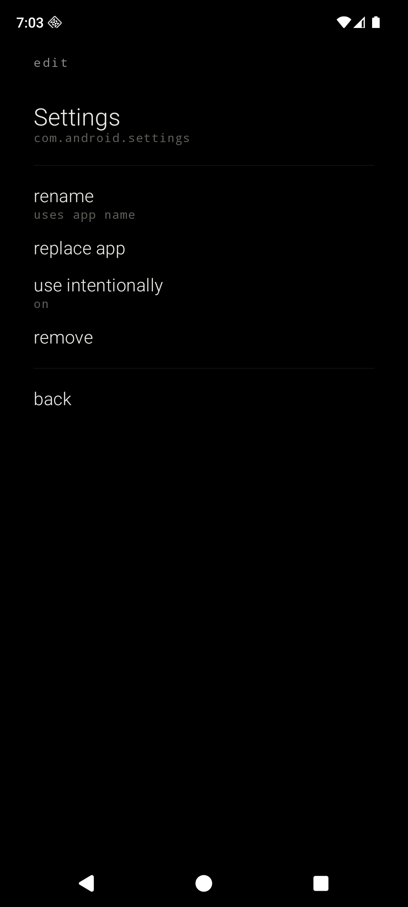
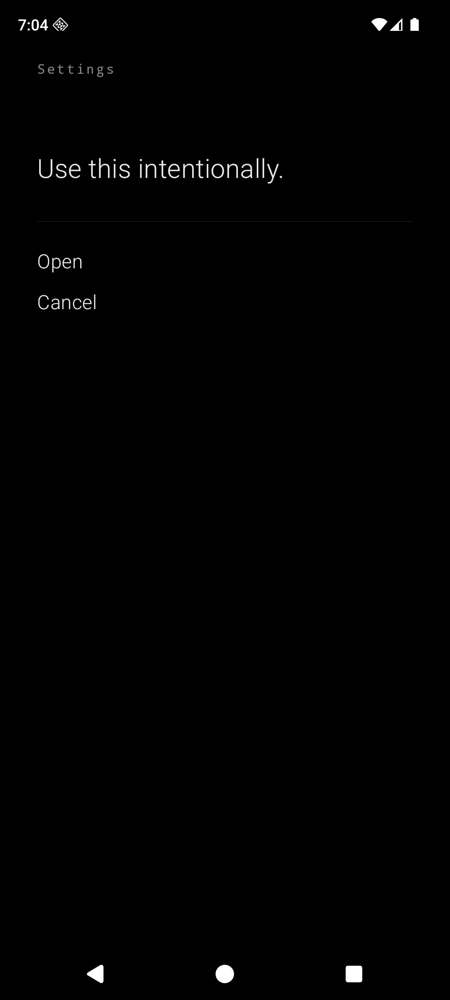

<div align="center">

# Still

#### A quiet launcher for Android.

<br>

&nbsp;&nbsp;

<br>

</div>

---

Still is a minimalist, privacy-first Android launcher. It is monochrome, OLED-first, text-first, and designed to make a modern Android phone feel closer to a beautiful dumb phone.

It declares no internet permission. It ships no analytics. It depends on neither Firebase nor Google Play Services. It targets a Pixel running GrapheneOS, but it runs on any Android device from API 26 up.

## What Still does

- Replaces the home screen with a clock, a date, and **up to seven user-defined slots**.
- Each slot opens an app you choose, with a label you choose. Mappings persist locally in Preferences DataStore.
- Any slot can be marked **use intentionally** — tapping it opens a friction screen (*Use this intentionally. Open or Cancel.*) before launching. The browser is no longer privileged; the gate generalizes to any slot you want to make harder to reach.
- Tap an empty slot to assign an app. Long-press a filled slot to rename, replace, toggle the friction flag, or remove. Long-press the home background to open the hidden all-apps list and settings.

## What Still refuses to do

- No `INTERNET` permission.
- No `QUERY_ALL_PACKAGES`. Package visibility is scoped via `<queries>` to apps that expose a launchable activity.
- No analytics, no telemetry, no Firebase, no Google Play Services, no ads.
- No cloud backup of settings — `data_extraction_rules.xml` excludes every domain.
- No icons on the home. No widgets. No default app drawer. No search. No notification listener. No accessibility service. No `+` buttons. No branding on the home screen.

## Privacy posture, in code

| File | What it guarantees |
| --- | --- |
| `app/src/main/AndroidManifest.xml` | No permissions declared; `<queries>` limits package visibility to launchable apps |
| `app/src/main/res/xml/data_extraction_rules.xml` | Excludes every sharedpref / file / database domain from cloud backup and device transfer |
| `app/build.gradle.kts` | Dependencies only on AndroidX, Compose, and DataStore — no Firebase, no GMS, no analytics SDK |

## Architecture

```text
MainActivity
└── StillApp                       single-Activity Compose shell
    ├── HomeViewModel
    │   ├── AppRepository
    │   │   ├── PackageScanner     ACTION_MAIN + CATEGORY_LAUNCHER, scoped
    │   │   └── PreferencesRepo    Preferences DataStore (slot index → app + label + friction)
    │   └── AppLauncher            explicit component launches only
    └── Compose surfaces
        ├── HomeScreen             clock, date, up to seven slots
        ├── SlotEditScreen         long-press a filled slot
        ├── SlotRenameScreen       custom labels per slot
        ├── AppPickerScreen        list of launchable apps
        ├── AllAppsScreen          revealed by long-press on background
        ├── SettingsScreen         all slots in one list
        └── FrictionScreen         "Use this intentionally."
```

Kotlin, Jetpack Compose, AGP 9, Gradle Kotlin DSL. Slots are anonymous indices `0..6` — there is no enum mapping to specific app types. Navigation Compose is intentionally avoided; a small sealed-class router lives in `StillApp.kt`.

## Design language

- OLED black background. Soft white primary text. Gray secondary text. Hairline dividers.
- Serif for the clock. Sans-serif for menu items. Monospace for the kicker and captions.
- Lowercase for verbs (`add app`, `rename`, `back`). Title case only for app labels — those belong to the apps.
- No ripple. Fade-only transitions. No bouncy motion, no colorful accents.
- System fonts in the MVP. Open-source fonts can be dropped into `app/src/main/res/font/` and wired through `StillTypography.kt`.

## Build and install

Requirements: **JDK 17**, the **Android SDK** with `platforms;android-36` and `build-tools;36.0.0`. The Gradle wrapper (9.4.1) is bundled.

```bash
./gradlew assembleDebug
adb install -r app/build/outputs/apk/debug/app-debug.apk
```

Then, on the device: **Settings → Apps → Default apps → Home app → Still**.

For development on an emulator, set Still as the default Home directly:

```bash
adb shell cmd package set-home-activity dev.chuds.still/.MainActivity
```

## Notes for GrapheneOS

Still depends on no part of Google Play Services, so it runs cleanly on a fresh GrapheneOS profile. There are no first-boot heuristics — every slot starts empty. Long-press the home background to open the hidden all-apps list, then either tap an empty slot directly or open settings to map every slot at once.

## Status

MVP. Builds against AGP 9.2.1 / Kotlin 2.3.21 / `compileSdk 36`. Verified end-to-end on a Pixel 8a Android 36 AOSP emulator: HOME-intent resolution, default-Home behavior, slot model, custom labels, per-slot friction gate, tap-to-launch, long-press → all apps. Not yet daily-driven on hardware. The screenshots above are real, not mockups. Planned work lives in [`TODO.md`](TODO.md).

## License

MIT. See [`LICENSE`](LICENSE).
