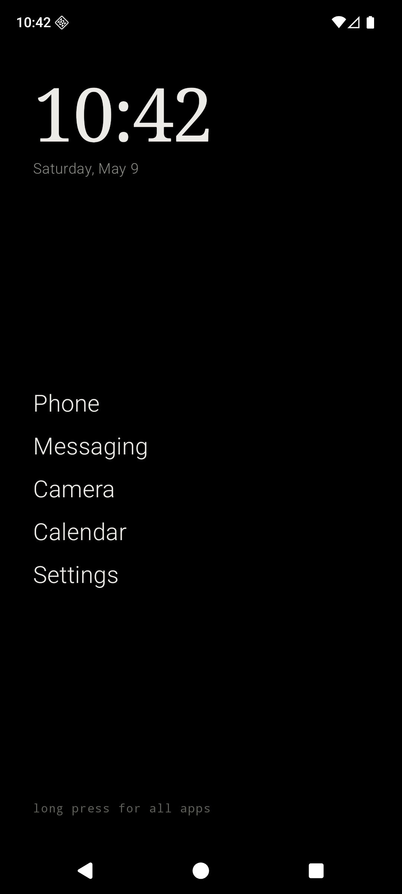
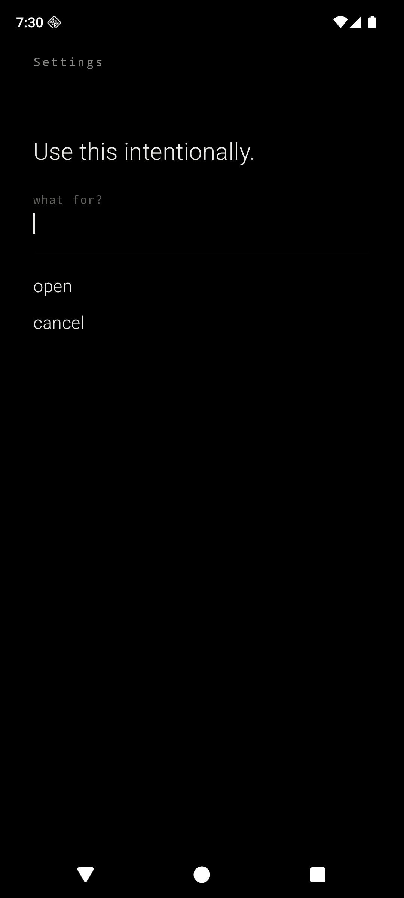
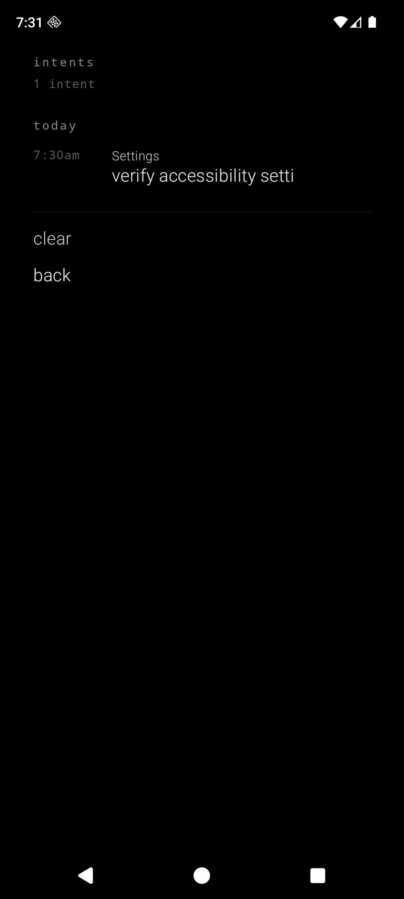
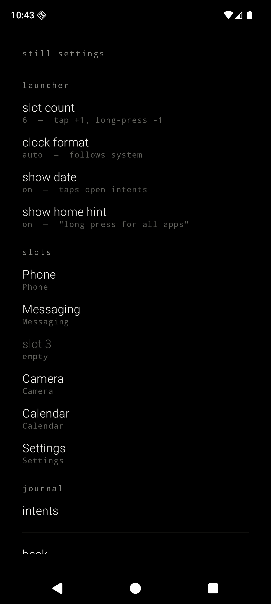

<div align="center">

# Still

#### A quiet launcher for Android.

<br>

&nbsp;&nbsp;&nbsp;

<br>

</div>

---

Still is a minimalist, privacy-first Android launcher. It is monochrome, OLED-first, text-first, and designed to make a modern Android phone feel closer to a beautiful dumb phone.

It declares no internet permission. It ships no analytics. It depends on neither Firebase nor Google Play Services. It targets a Pixel running GrapheneOS, but it runs on any Android device from API 26 up.

## What Still does

- Replaces the home screen with a clock, a date, and **the slots you've filled** — nothing else. No wordmark, no `add app` placeholders, no empty rows. The home shows only what you put on it.
- **Sane first-launch defaults**: Phone, Messaging, Browser, Camera, Calendar, Settings, resolved from system intents. Each slot is yours to rename, replace, or remove.
- Each slot opens an app you choose, with a label you choose. Mappings persist locally in Preferences DataStore.
- Any slot can be marked **use intentionally** — tapping it opens an intent prompt (*Use this intentionally. what for?*) before launching. Type a sentence, press Done, and the app opens. (Settings is exempt — it's the escape hatch and must always be one tap away.)
- An **intent journal** records what you typed every time you launched something through the prompt. Tap the date on the home screen to read back through it. Still doesn't block anything; it just remembers what you said you'd do.
- **Configurable**: slot count (1–10), 12/24-hour clock, date toggle, home-hint toggle, per-slot friction. Every choice is yours to make.
- Long-press the home background to reveal a hidden all-apps list and settings.

## The intent journal

Still doesn't restrict you from using apps. It can't, and it shouldn't. What it can do is hand the question back to you: *what is this for?*

Mark a slot **use intentionally**. The next time you tap it, Still asks what you're opening it for. You type a sentence — anything — and it opens. The text is journaled locally, alongside the slot label and a timestamp. Days later, you tap the date on the home screen and read through the list.

Reading the journal is the whole mechanism. The launcher is not the conscience. You are.

The journal lives entirely on-device in a separate Preferences DataStore (`still_journal`). The most recent 500 entries are kept. Cleared with two taps in the journal screen. Excluded from cloud backup and device transfer.

## What Still refuses to do

- No `INTERNET` permission.
- No `QUERY_ALL_PACKAGES`. Package visibility is scoped via `<queries>` to apps that expose a launchable activity.
- No analytics, no telemetry, no Firebase, no Google Play Services, no ads.
- No cloud backup of settings or journal — `data_extraction_rules.xml` excludes every domain.
- No icons on the home. No widgets. No default app drawer. No search. No notification listener. No accessibility service. No `+` buttons. No branding.

## Privacy posture, in code

| File | What it guarantees |
| --- | --- |
| `app/src/main/AndroidManifest.xml` | No permissions declared; `<queries>` limits package visibility to launchable apps |
| `app/src/main/res/xml/data_extraction_rules.xml` | Excludes every sharedpref / file / database domain from cloud backup and device transfer |
| `app/build.gradle.kts` | Dependencies only on AndroidX, Compose, and DataStore — no Firebase, no GMS, no analytics SDK |

## Architecture

```text
MainActivity
└── StillApp                          single-Activity Compose shell
    ├── HomeViewModel
    │   ├── AppRepository
    │   │   ├── PackageScanner        ACTION_MAIN + CATEGORY_LAUNCHER, scoped
    │   │   └── PreferencesRepository slot config + launcher prefs
    │   ├── IntentJournalRepository   separate DataStore, JSON-encoded entries
    │   └── AppLauncher               explicit component launches only
    └── Compose surfaces
        ├── HomeScreen                clock, date, filled slots only
        ├── IntentPromptScreen        "Use this intentionally. what for?"
        ├── IntentsScreen             reverse-chrono journal, grouped today/yesterday/earlier
        ├── SlotEditScreen            long-press a filled slot
        ├── SlotRenameScreen          custom labels per slot
        ├── AppPickerScreen           list of launchable apps
        ├── AllAppsScreen             revealed by long-press on background
        └── SettingsScreen            launcher prefs, slots, journal
```

Kotlin, Jetpack Compose, AGP 9, Gradle Kotlin DSL. Slots are anonymous indices `0..9` — there is no enum mapping to specific app types. Navigation Compose is intentionally avoided; a small sealed-class router lives in `StillApp.kt`. Journal entries are encoded as JSON via `org.json` (no extra serialization dependency).

## Gestures

| Gesture | Effect |
| --- | --- |
| Tap a filled slot | Launch (or open the intent prompt, if the slot is gated) |
| Long-press a filled slot | Edit slot — rename, replace, toggle friction, remove |
| Long-press home background | Open all apps |
| Tap the date | Open the intent journal |

Slot count, clock format, and the date row itself are configured under **still settings → launcher**.

## Design language

- OLED black background. Soft white primary text. Gray secondary text. Hairline dividers.
- Serif for the clock. Sans-serif for menu items. Monospace for kickers and captions.
- Lowercase for verbs (`open`, `cancel`, `back`). Title case only for app labels — those belong to the apps.
- No ripple. Fade-only transitions. No bouncy motion, no colorful accents.
- System fonts in the MVP. Open-source fonts can be dropped into `app/src/main/res/font/` and wired through `StillTypography.kt`.

## Build and install

Requirements: **JDK 17**, the **Android SDK** with `platforms;android-36` and `build-tools;36.0.0`. The Gradle wrapper (9.4.1) is bundled.

```bash
./gradlew assembleDebug
adb install -r app/build/outputs/apk/debug/app-debug.apk
```

Then, on the device: **Settings → Apps → Default apps → Home app → Still**.

For development on an emulator, set Still as the default Home directly:

```bash
adb shell cmd package set-home-activity dev.chuds.still/.MainActivity
```

## Notes for GrapheneOS

Still depends on no part of Google Play Services, so it runs cleanly on a fresh GrapheneOS profile. On first launch it resolves the canonical system apps for Phone, Messaging, Browser, Camera, Calendar, and Settings via standard category intents and seeds the slot list — categories that don't resolve (e.g. no preinstalled browser) leave their slots empty for you to fill.

## Status

MVP. Builds against AGP 9.2.1 / Kotlin 2.3.21 / `compileSdk 36`. Verified end-to-end on a Pixel 8a Android 36 AOSP emulator: HOME-intent resolution, default-Home behavior, slot model, configurable launcher prefs, custom labels, per-slot friction gate, intent prompt, journal write/read/clear, tap-on-date gesture, long-press → all apps. Not yet daily-driven on hardware. The screenshots above are real, not mockups. Planned work lives in [`TODO.md`](TODO.md).

## License

MIT. See [`LICENSE`](LICENSE).
